Examining Data of Molecular Simulations

Reading papers such as EquiJump has lead to the discovery of a new dataset. Since EquiJump does not provide a git implementation, lets see if we can make one.
The necessary compute will be a hurdle (they train on 2-4 A100 GPUs), but to code it up and see if it can at least overfit, one can simply use the smallest protein in the dataset.

Let us start with Step 1: Understand the Data and choose a representation. 
This is one of the most important steps in artificial intelligence and machine learning which is sometimes overlooked. 
The representation decides what information is available, how it can be processed, which biases are introduced. 
It is a crucial element.

Let us start with the raw data. 
Here a snapshot of the molecular dynamics simulation (see the notebook script):

  

One can see bonds and atom types as well as arrows representing the backbone. 
Any chemist beyond high-school will admit that these drawn edges, i.e. the bonds, are not really physical. 
Instead they serve as visual anchors for the electronic forces that arise from the quantum-chemical Hamiltonian. 
Solving for the ground-state wave-function of this hamiltonian determines the energy landscape, and thus, by the Hellmann–Feynman theorem the forces on all the particles.
In addition, it also determines the electronic density, which in turn, by the Kohn-Sham Theorem, determines all properties of the Hamiltonian system.
The forces that play a role in such a system are electronic attraction and repulsions through densities; the kinetic contributions to the pressure and stress tensors through the momentum of the nuclear and electronic wavepackets; statistical correlations through Fermi-statistics and the Pauli exclusion principle (often called exchange effects); and correlated motions arising from the instantaneous Coulomb interactions that are generally not captured by independent-particle or mean-field approximations..
Due to the size of the atomic system protein dynamics simulations tend to classical force fields which are in turn derived form quantum chemical approximations.
Recently, geometric feature based graph neural networks have shown great promise in machine learning these force fields from quantum chemical ab-initio datasets. 
However, contrary to protein folding, the dynamics considered in such datasets are on a much smaller time-scale.
 
Instead of fitting to quantum-chemical ab-initio simulations, EquiJump applies the principles of geometric deep learning to molecular dynamics datasets and shows that one can learn the dynamics of large proteins through coarse-grained representations and geometric features. It combines two topics that are fascinating to me personally: Equivariant Deep Learning and Stochastic Interpolants, Schrödinger Bridges or end-point fixed Diffusion. The last three concepts are largely analogous and refer to different perspectives on the same Problem.
 
Going back to the raw data. The Hamiltonian is fully determined by the potential and kinetic energy of all wavepackets. 
In the Born-Oppenheimer approximation (which your MD snapshot likely assumes), one usually treats the nuclei as classical point particles. While the electrons have kinetic energy and momentum integrated into the Hamiltonian, the forces acting on the atoms are typically calculated under the assumption that the electrons are always in their ground-state. In essence, the large difference in time-scales between the motions of atoms and electrons, one will consider that the electrons instantaneously fall into their ground state as soon as an atom move. Thus, the energy landscape is determined by the positions of all atoms. This abiabatic approximation tends to be baked into the classical force field. Keep in mind that it fails for non-adiabatic processes, such as photosynthesis.
 
Equally, EquiJump assumes that the molecular dynamics are determined by the positions of all atoms. Such a problem is already complex enough, considering that a protein can have several thousands, potentially all interacting with each other and already the three-body problem is highly chaotic, much more so the many-body problem.
 
The atom positions are easily represented as a labeled point cloud. Numpy will serve as intermediary since it is relatively slim and easily integrated into pytorch or jax computations. Paraview will serve as visualization platform to ensure plausibility along each transformation. A possibility would be to use graph neural networks on an all-atom radius graph. The following image shows all atoms as a point cloud and the corresponding  graph with a five Angstrom radius:

  
  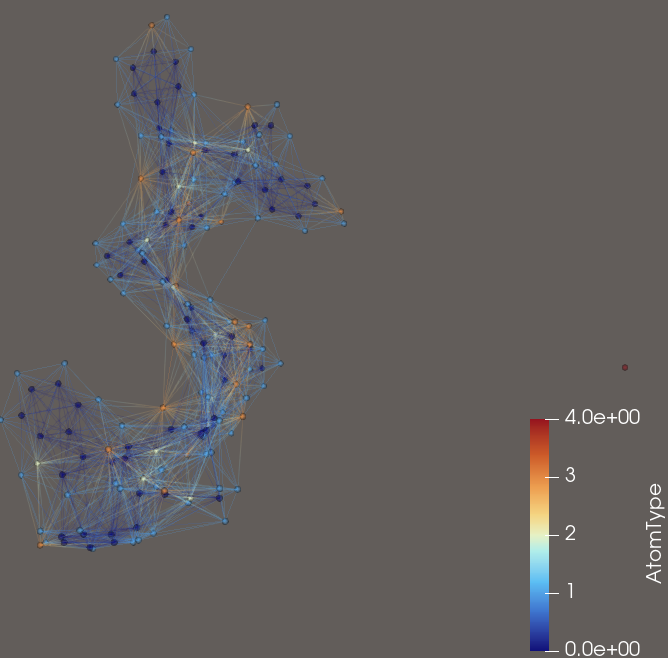

This representation does not scale well. Other papers, such as EquiJump and Ophiuchus use a residue representation. Each Amino-Acid is represented by its label, the position of its C_alpha atom and the positions of other atoms relative to the C_alpha atom. A protein can be understood as a one-dimensional sequence of these residue descriptions. This description scales better. The following image shows the residues and the corresponding atoms.
Aparently it is common to consider only the heavy atoms. Then a residual has maximally 13 such connections.

  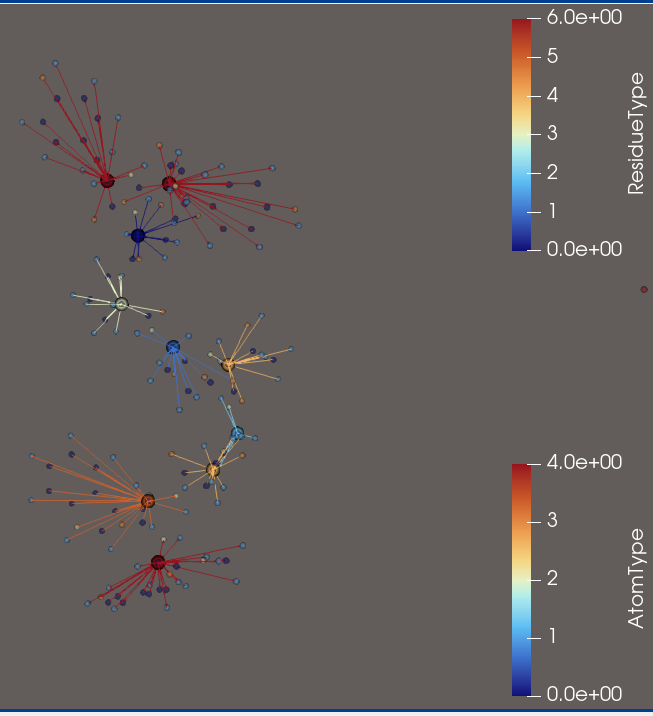
  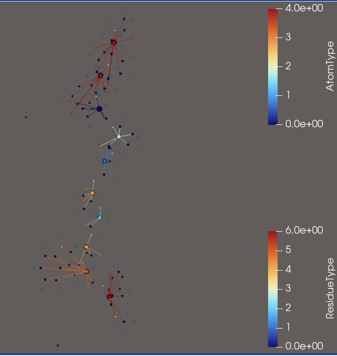

In EquiJump a protein is represented as a Tensor Cloud. 
A Tensor Cloud is set, whose elements are tuples. Each tuple is a tensor V_i associated to a 3D position P_i, in essence (V_i, P_i), where V_i is a tensor of irreducible representations with degree cutoff l_max.

The i-th resiudal will be represented as {R_i, P_i, V_i} with R_i being its label, P_i being the position of the C_alpha atom and V_i being a 13x3 matrix of  l=1 representations with multiplicity 13. These features represent the relative distances of the heavy atoms. If a residual has less than 13 heavy atoms, the representation is padded. The ordering of the 13 features requires a canoncial ordering of the heavy atoms.

  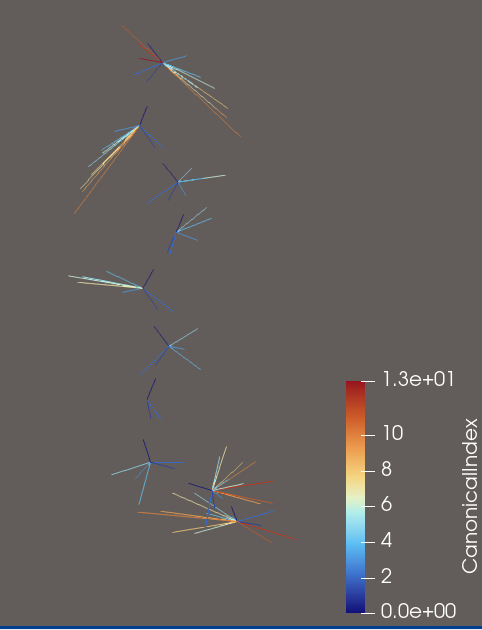
  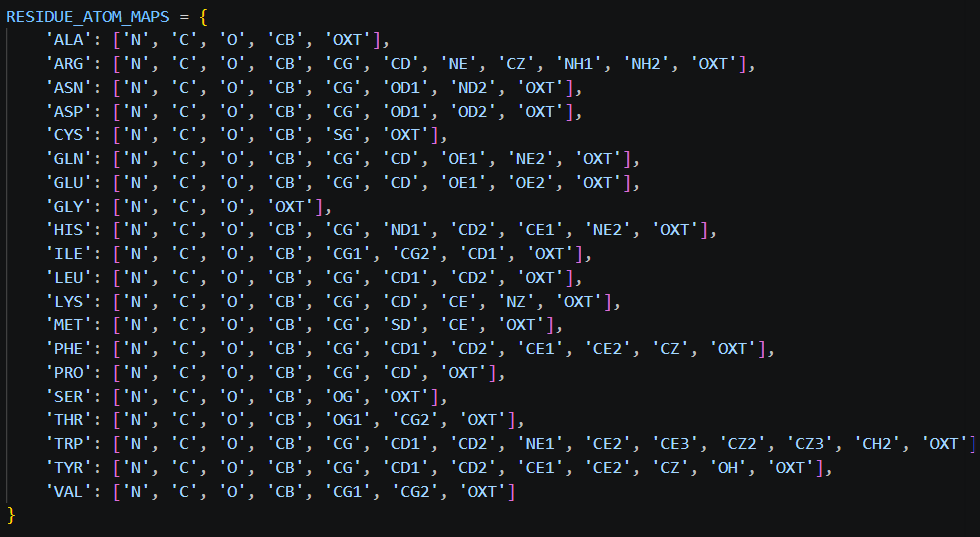

  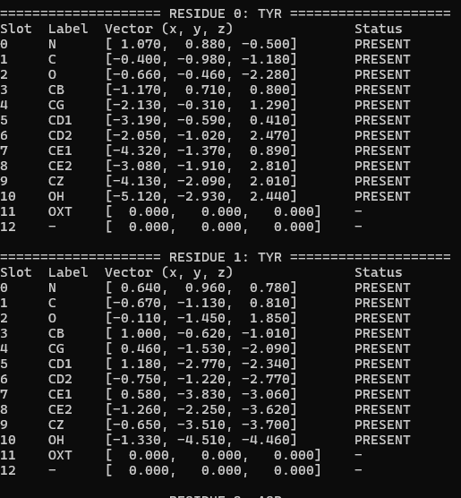
  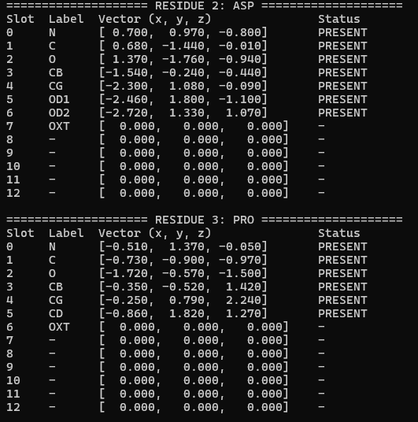

Step 2: Building the NN modules

Three mechanisms are implemented.

The Self-Interaction Mechanism (updates the tensor cloud of each residual independently by performing tensor-products with its own features) 

  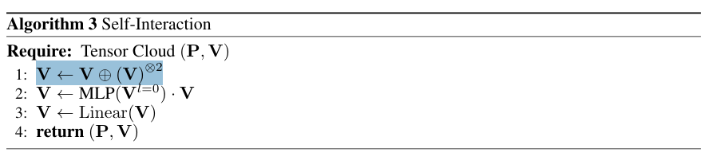

the Spatial Convolution (essentially message passing between residual representations to update the i-th residual)

  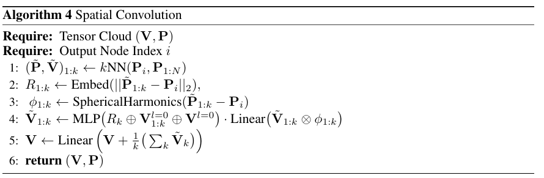

the full model, combines Self-Interaction with Spatial Convolutions to outputs the target irrep arrays for each residual (node).

  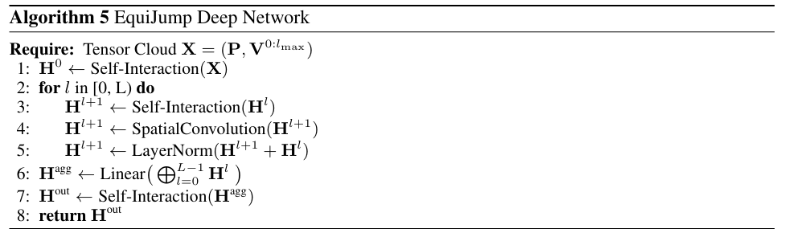

This full network will be the backbone for the training. It receives a tensor-cloud as input and outputs the specified geometric irreps.
The irreps of each node can be specified independently. 
 
This enables the implementation of a specific information flow in which one computes
 
1: latent geometric features, conditioned on a scalar field of one-hot encodings related to the the residual label (i.e. the residual field) and the tensor cloud at time t initialized with V_ij as relative distances from the C_alpha atom
 
2: The output features can be added to the tensor cloud at time tau, which is obtained by stochastic interpolation. Additionally, a scalar field representing the time tau is added. This is the input tensor cloud to the following four networks, each tasked with the approximation of the position and feature drift and noise respectively.

  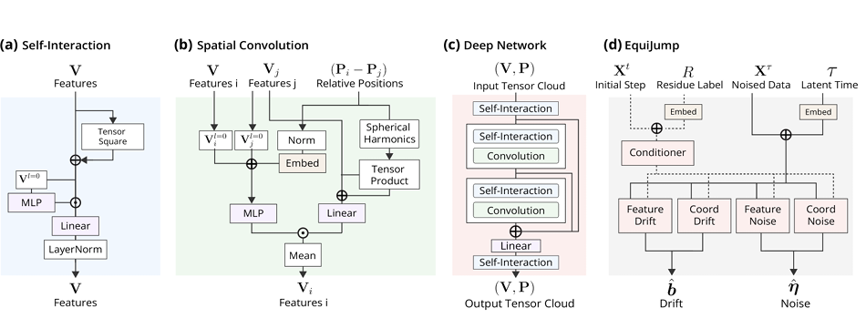>

Step 3: 

The training, based on stochastic interpolants, interprets the model output as drift and scores of an end-point fixed focker-plank density evolution. By choosing the interpolant (here a linear interpolant) between endpoints, a differentiable objective can be formulated for both quantities. 

The state of the SDE is X = (P,V), where P is a 3D position and V a tensor product of irreps up to order l_max. By choosing a basis for the representations and treating the tensor as high-dimensional vector in that basis, the SDE on the tensorial part of X can be written as dV = b(X,V)dt + sigma(X,V)dW_t, under the condition that b(X,V) and sigma(X,V) be equivariant. By working in this basis, the linear stochastic interpolaton V_t = t V_1 + (1-t)V_0 + sigma(t)z_t remains valid, i.e. at each time t, V_t represents the irreps.

(ToDo)

Step 4: 

Validation by projecting the energy landscapes of molecular trajectories onto the 2 principal TiCA components.

(ToDo)