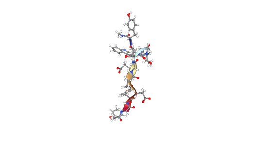
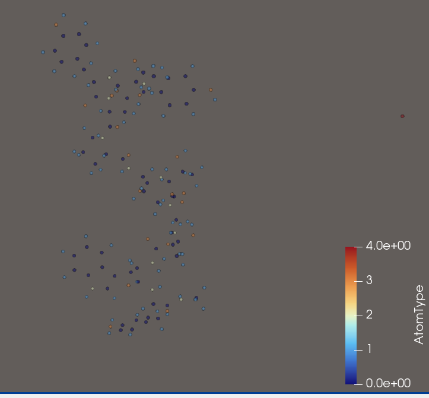

Examining Data of Molecular Simulations

Reading Papers such as EquiJump has lead to the discovery of a new dataset. Since EquiJump does not provide a git implementation, lets see if we can make one.
The necessary compute will be a hurdle (they train on 2-4 A100 GPUs), but to code it up and see if it can at least overfit one can simply use the smallest protein in the dataset.

Step 1: Understand the Data and choose a Representation 

Here a snapshot of the molecular dynamics simulation (see the notebook script):

  

For Neural Networks a different data representation will be required. Numpy will serve as intermediary since it is relatively slim and easily integrated into pytorch or jax computations. Paraview will serve as visualization platform to ensure plausibility along each transformation. A possibility would be to use graph neural networks on an all-atom radius graph. The following image shows all atoms as a point cloud and the corresponding  graph with a five Angstrom radius:

  
  

This representation does not scale well. Other papers, such as EquiJump and Ophiuchus use a residue representation. Each Amino-Acid is represented by its label, the position of its C_alpha atom and the positions of other atoms relative to the C_alpha atom. A protein can be understood as a one-dimensional sequence of these residue descriptions. This description scales better. The following image shows the residues and the corresponding atoms.
Aparently it is common to consider only the heavy atoms. Then a residual has maximally 13 such connections.

  
  

Step 2: Building the initial representation

In Equijump a Protein is represented as a Tensor Cloud. 
A Tensor Cloud is set, whose elements are tuples. Each tuple is a tensor V_i associated to a 3D position P_i, in essence {V_i, P_i}, where V_i is a tensor of irreducible representations with degree cutoff l_max.

The i-th resiudal will be represented as {R_i, P_i, V_i} with R_i being its label, P_i being the position of the C_alpha atom and V_i being a 13x3 matrix of  l=1 representations with multiplicity 13. A sensible initialization could be setting the l=1 representations to the relative distances of the heavy atoms. If a residual has less than 13 heavy atoms, the representation is set to 0. The ordering of the 13 features requires a canoncial ordering of the heavy atoms.

(ToDo)

Step 3: Building the NN modules

Three mechanisms need to be implemented.

The Self-Interaction Mechanism (updates the tensor cloud by performing tensor-products with itself) 

the Spatial Convolution (essentially message passing between residual representations)

the full model, combines Self-Interaction with Spatial Convolutions to output n l1 representations.

(ToDo)

Step 4: 

The training, based on stochastic interpolants, interprets the model output as drift and scores of an end-point fixed fokker-plank density evolution. By choosing the interpolant (here a linear interpolant) between endpoints, a differentiable objective can be formulated for both quantities. 

(ToDo)

Step 5: 

Validation by projecting the energy landscapes of molecular trajectories onto the 2 principal TiCA components.

(ToDo)